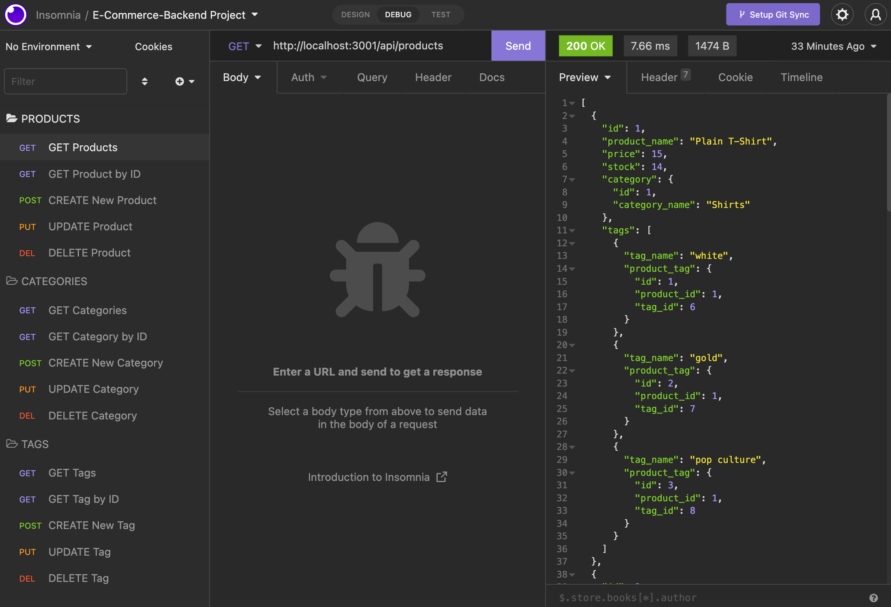
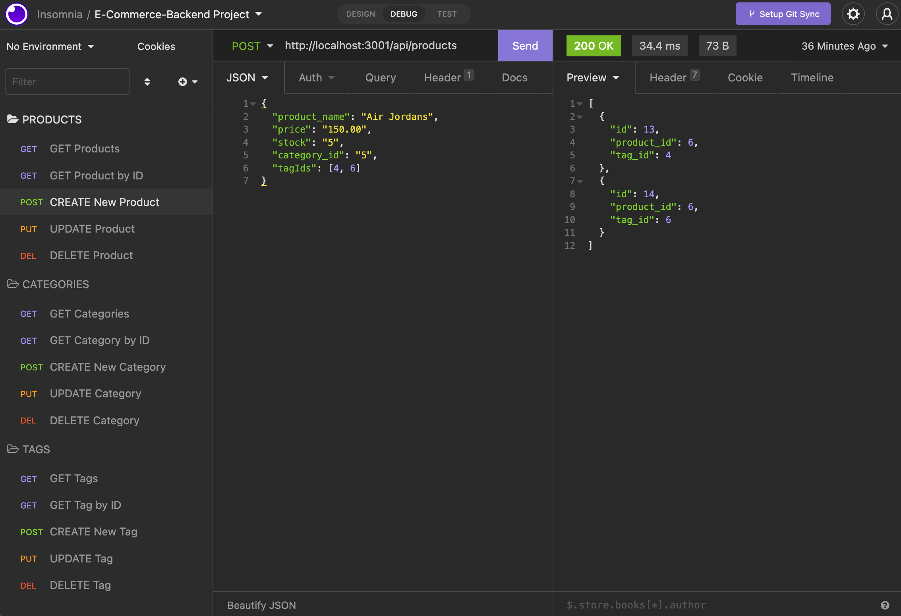

# E-Commerce-Backend


Building a functional backend for an e-commerce site 

## Description
The purpose of this project was to create a functional back end for a fictional e-commerce site. The project involved configuring a working Express.js API to use the `Sequelize` npm package in order to properly interact with a MySQL database.

Once properly set up and running, the user can utilize their desired API testing tool, such as Insomnia or Postman, to send various HTTP requests to our server, which can modify the MySQL database.

The user can make `GET`, `POST`, `PUT`, and `DELETE` requests to modify the database. I have attached a video demonstration below for further information.

## Table of Contents
* [Installation](#installation)
* [Licenses](#licenses)
* [Demonstration](#demonstration)
* [Questions](#questions)

## Installation
This application utilizes the following npm packages:
* [Sequelize](https://www.npmjs.com/package/sequelize)
* [MySQL2](https://www.npmjs.com/package/mysql2)
* [Dotenv](https://www.npmjs.com/package/dotenv)

Please be sure to carefully follow the installation instructions.

1. This app is run on Node.js and MySQL, as a result, make sure those are properly installed and configured before continuing on.
2. Navigate to the root of this repo and run `npm install` in your console/terminal to download all the necessary npm packages.
3. Create a `.env` file in the root of the repo. Within this file, copy and paste the following: 
```md
DB_NAME=ecommerce_db
DB_USER=<user_name>
DB_PASSWORD=<user_password>
```
4. Change the value of `DB_USER` and `DB_PASSWORD` to your MySQL user and password respectively. Save these changes.
5. Execute `mysql -u root -p` in your console/terminal.
6. Once succesfully logged in, execute `source db/schema.sql` to create database. Exit when finished.
7. In your console/terminal, execute `npm run seed` to seed your newly created database.
8. You are now ready to turn on the server by running `npm start`.

## Licenses
This project falls under the following license(s): 

* MIT

## Demonstration
Screenshot of the a `GET` request made to `http://localhost:3001/api/products` within Insomnia:



Screenshot of the a `POST` request made to `http://localhost:3001/api/products` within Insomnia:



A video demonstration of this application can be found by clicking [here!](https://drive.google.com/file/d/1Dkjd5GYthYcD28pRiEwNEJmyzv6WZt1H/view
)
## Questions
If you have any questions, please contact me below: 

Github: [TonyQ032](https://github.com/TonyQ032) 

Email: AnthonyQ032@gmail.com


Copyright (c) 2022 Anthony Quinones